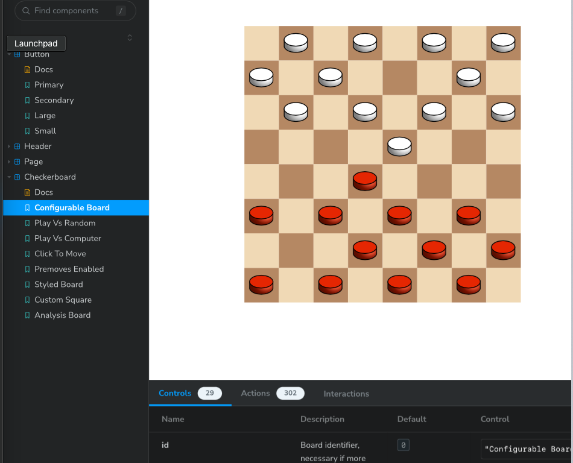

<div align="center" markdown="1">

# [react-checkerboard](https://react-checkerboard.vercel.app/)

## Inspired and adapted from the React Chessboard Library used at [ChessOpenings.co.uk](https://chessopenings.co.uk)

</div>

## What is react-checkerboard?

react-checkerboard is a React component that provides checkerboard functionality to your application. The logic that controls the board is independent to the board itself, using a game engine such as [Ravenback](https://github.com/bcorfman/ravenback). This engine integration is still in-process.

<center>
    
</center>

## Installation

```
npm i react-checkerboard
```

## LICENSE

MIT
